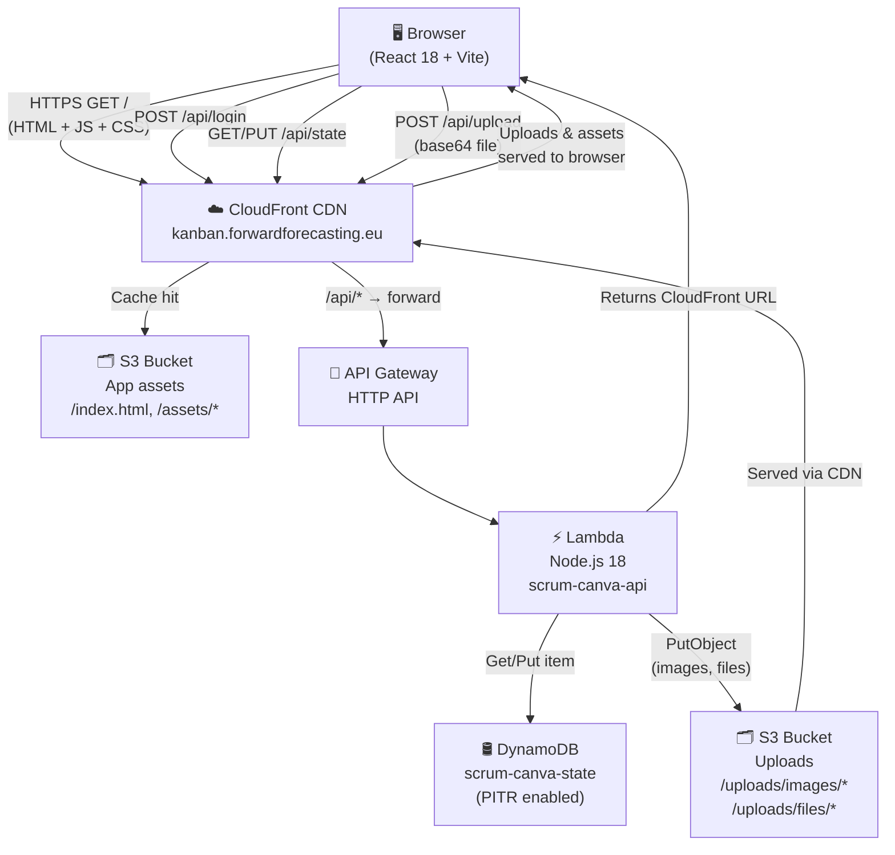

# Kanban Board

A private, cross-device Kanban board with drag-and-drop task management, file attachments, and a month-view calendar — deployed as a fully serverless app at **[kanban.forwardforecasting.eu](https://kanban.forwardforecasting.eu/)**.

---

## Table of Contents

1. [Overview](#overview)
2. [Features](#features)
3. [Data Flow](#data-flow)
4. [Tech Stack & Libraries](#tech-stack--libraries)
5. [Architecture](#architecture)
6. [AWS Cost Estimation](#aws-cost-estimation)

---

## Overview

A personal Kanban board built for single-user private use, accessible from any device. Tasks live in four columns (To Do, In Progress, Done, Backlog) and can carry rich metadata: categories with custom colors, urgency levels, due dates, start/end datetimes, location links, images, PDF/TXT/CSV attachments, and URL links. All state is persisted in DynamoDB and synced across devices in real time.

---

## Features

- **Drag-and-drop** between columns via `@hello-pangea/dnd`
- **Post-it cards** — full background color driven by user-defined categories
- **3 urgency levels** — Today / This Week / This Month
- **Backlog** — staging area with one-click promotion to any column
- **Rich card metadata** — links, images (compressed client-side), PDF/TXT/CSV attachments with inline viewer, location map link, start/end datetimes
- **Calendar view** — month grid showing tasks by completion date
- **JWT auth** — private service, single user, 30-day token
- **Cross-device sync** — DynamoDB as single source of truth, debounced push on every state change
- **File drive** — all uploads browsable at `drive.forwardforecasting.eu`

---

## Data Flow



### Processing steps

| Step | Where | What happens |
|---|---|---|
| Login | Lambda | Credentials compared to env vars; custom HS256 JWT signed and returned |
| State load | Lambda → DynamoDB | Full `AppState` JSON fetched; client merges with localStorage (most tasks wins) |
| Image upload | Browser → Lambda → S3 | Canvas API resizes to max 1200 px, JPEG 0.82; base64 POSTed; Lambda writes to S3 and returns CloudFront URL |
| File upload | Browser → Lambda → S3 | FileReader base64; Lambda writes PDF/TXT/CSV to `uploads/files/`; returns URL |
| State push | Lambda → DynamoDB | Entire `AppState` JSON stored under `userId` key; debounced 1.5 s after every change |
| Drag-and-drop | Browser only | `@hello-pangea/dnd` reorders in-memory state; triggers debounced sync |

---

## Tech Stack & Libraries

### Frontend

| Library | Version | Purpose |
|---|---|---|
| **React** | 18 | UI component tree, hooks-based state management |
| **Vite** | 5 | Dev server and production bundler (ESM, content-hashed assets) |
| **TypeScript** | 5 | Static typing across all source files |
| **@hello-pangea/dnd** | 17 | Accessible drag-and-drop for the Kanban columns (fork of `react-beautiful-dnd`) |

> This project does **not** use AI, LLM, GenAI, speech-to-text, image diffusion, image classification, chatbots, RAG, Kafka, GraphQL, Kubernetes, or FastAPI. It is a pure task-management tool with no ML components.

### Backend (Lambda)

| Library | Purpose |
|---|---|
| **@aws-sdk/client-dynamodb** | Read/write app state |
| **@aws-sdk/util-dynamodb** | `marshall` / `unmarshall` helpers |
| **@aws-sdk/client-s3** | Store and list uploaded files |
| **Node.js `crypto`** | Custom HS256 JWT signing — no third-party JWT library needed |

---

## Architecture

```
kanban.forwardforecasting.eu
        │
        ▼
  CloudFront (E1AQDWOGNRBTEY)
  ┌──────────────────────────────────┐
  │  /api/*  ──► API Gateway HTTP    │
  │              └─► Lambda          │
  │                  ├─► DynamoDB    │
  │                  └─► S3          │
  │  /*      ──► S3 (OAC)           │
  │              ├── /index.html     │
  │              ├── /assets/        │
  │              └── /uploads/       │
  └──────────────────────────────────┘

drive.forwardforecasting.eu
        │
        ▼
  EC2 (nginx) ──► Streamlit :8504
  (cloud-drive backup monitor)
```

**Key design decisions:**

- **No server** — Lambda handles all API; static assets served directly from S3 via CloudFront OAC (no public bucket).
- **Single DynamoDB item per user** — entire board state stored as one JSON blob; simple, cheap, avoids query complexity.
- **Client-side image compression** — reduces upload size by ~60–80% before the base64 round-trip through API Gateway (which has a 10 MB body limit).
- **Custom JWT** — Node.js `crypto` only; avoids bundling `jsonwebtoken` or similar in the Lambda package.
- **Merge strategy** — on login, whichever side (local vs remote) has more tasks wins; prevents accidental overwrites from a fresh browser session.

---

## AWS Cost Estimation

Usage assumptions: 1 user, ~2 sessions/day, ~200 API calls/day, ~500 MB uploads total.

### Monthly

| Service | Resource | Est. cost |
|---|---|---|
| **CloudFront** | ~2 GB transfer out + 200 K requests | $0.18 |
| **S3** | ~500 MB storage + 10 K requests | $0.02 |
| **Lambda** | ~6 K invocations × 200 ms × 256 MB | $0.00 *(free tier)* |
| **API Gateway** | ~6 K HTTP requests | $0.01 |
| **DynamoDB** | ~6 K RCU/WCU on-demand + PITR ~0.01 GB | $0.20 |
| **ACM** | TLS cert | $0.00 |
| **Total** | | **≈ $0.41 / month** |

### Yearly

| | |
|---|---|
| **Estimated annual cost** | **≈ $5.00 / year** |

> Costs scale with upload volume. 10 GB of uploads would add ~$0.23/month in S3 storage and ~$0.85/month in CloudFront transfer. All other costs remain negligible at personal-use scale.

---

*Deployed with React 18 + Vite · Lambda Node.js 18 · DynamoDB · S3 · CloudFront*
